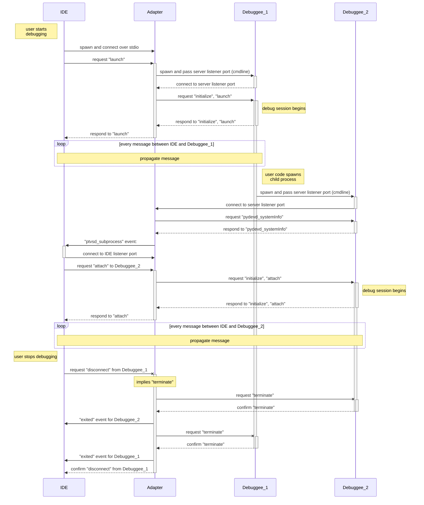
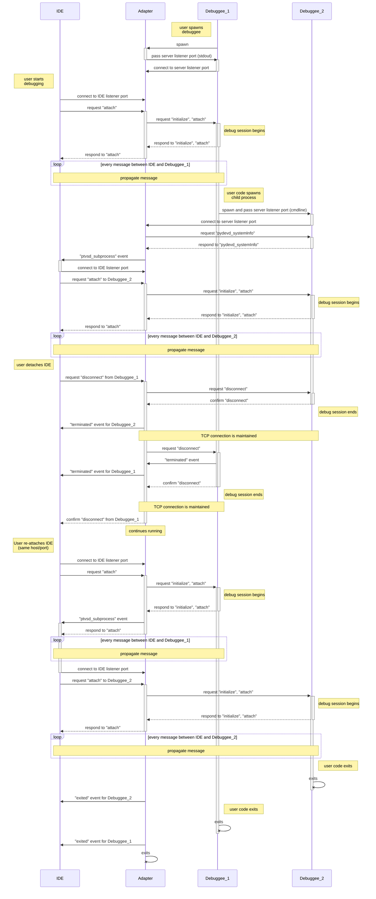

# Subprocess debugging

## Terminology

_Debuggee process_ - the process that is being debugged.

_IDE_ - VSCode or other DAP client.

_Debug server_ - pydevd with debugpy wrapper; hosted inside the debuggee process,
one for each.

_Debug adapter_ - debugpy adapter that mediates between IDE and server.

_IDE listener port_ - port opened by the adapter, on which it listens for incoming
connections from the IDE.

_Server listener port_ - port opened by the adapter, on which it listens for incoming
connections from the servers.

_Adapter listener port_ - port opened by the server, on which it listens for incoming
connection from the adapter.

## "launch" scenario

1. User starts debugging (F5) with "launch" debug config.
1. User code spawns child process.
1. User stops debugging.

## "attach" scenario

1. User starts debuggee process with debug server in it (debugpy command line or `debugpy.enable_attach()`).
1. User starts debugging (F5) with "attach" debug config.
1. User code spawns child process.
1. User disconnects from debuggee.
1. User reconnects to debuggee.

## Important points

### How does the adapter know that connection from the server is for a subprocess?

By counting connections. The first one is for the root process, all others are for
subprocesses of that process.

### How does the adapter track server connections?

It creates a `Session` instance as soon as the server establishes a socket connection,
and maintains it until the corresponding debuggee process exits. Whenever the IDE
disconnects, the state of the instance is reset.

### How does the IDE know which subprocess to connect to?

It receives a "ptvsd_subprocess" event from the adapter (using the connection for the
root process), which contains host and port on which the adapter is listening for new
connections from the IDE, and PID of the subprocess. It then connects to the specified
host and port, and sends an "attach" request with "processId" from the event.

### How does the adapter know that connection from the IDE is for a specific subprocess?

The first connection is always for the root process. All subsequent connections are
for subprocesses, and must have "processId" specified in the "attach" request. The
adapter keeps track of PID for all processes that it tracks, and uses the PID specified
in the "attach" request to look up the corresponding `Session`.

### How does the server know that IDE has connected or disconnected?

The adapter sends an "initialized" request to the server for every one it receives from
the IDE, and sends a "disconnected" request every time the IDE disconnects (even if it
doesn't send one itself). The server uses those events to keep track of logical debug
sessions, even though the TCP connection is the same throughout the lifetime of the
debuggee. This allows it to enable/disable tracing, continue running if it was stopped
at a breakpoint etc.
